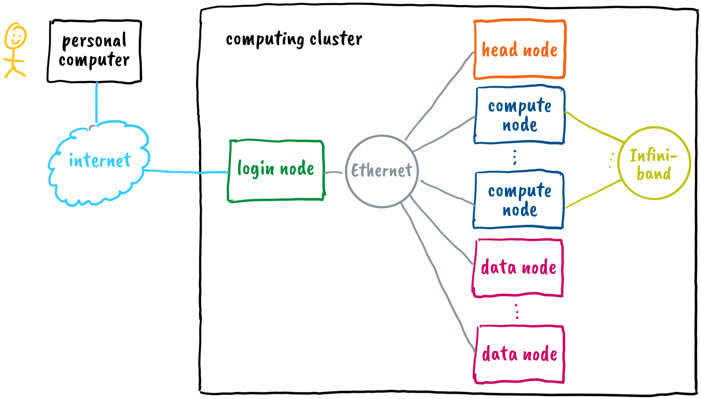

# Cluster

- in previous chapter we only focused on the compute nodes
- the architecture of typical cluster is as follows

  

  - the head nodes keeps the whole cluster running in a coordinated manner - it runs programs that monitor the status of other nodes, distribute jobs to compute nodes, supervise job execution, and perform other management tasks

  - the login nodes enable users to work with the cluster - transfer data and programs to and from the cluster, prepare, monitor, and manage jobs for compute nodes, reserve computational resources on compute nodes, log in to compute nodes, and similar

  - compute nodes execute the jobs prepared on the login nodes; there are various types of compute nodes available, including CPU-only nodes, high-performance CPU nodes with more memory, nodes equipped with graphics accelerators, and special notes with FPGA accelerators; based on their characteristics, compute nodes are organized in partitions

  - data and programs are stored on data nodes, which form a distributed file system, such as ceph: the distributed file system is accessible to all login and compute nodes - files transferred to the cluster through the login node are stored in the distributed file system

  - all nodes are interconnected by high-speed network links, typically Ethernet and sometimes InfiniBand (IB); network links are preferably high bandwidth and low latency

  